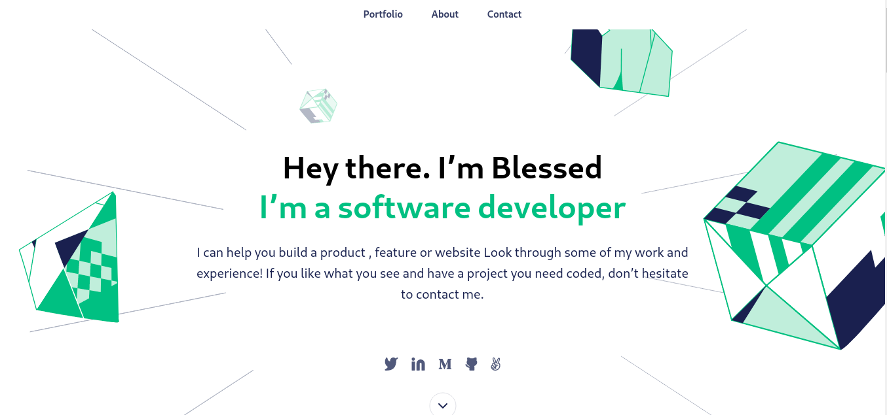

# My Portfolio  > Moved to [http://blessedjasonmwanza.me](http://blessedjasonmwanza.me)

> This is my first mobile version Portfolio Project built under Microverse program.




## Built With

- HTML
- CSS
- JS

## Live Demo

[Click here to view Live website Demo](https://blessedjasonmwanza.github.io/my-portfolio-microverse/)


## Getting Started
If you want a copy of this file go to the [GitHub repository](https://github.com/blessedjasonmwanza/my-portfolio-microverse) and download it from the link below.
- [My Microverse Project](git@github.com:blessedjasonmwanza/my-portfolio-microverse.git)

#### Setup
```bash
git clone git@github.com:blessedjasonmwanza/my-portfolio-microverse.git
cd Hello World
```
> Open a index.html file with your code editor of your choice and/or a browser of your choice.
```bash
Open the project using a live saver extension that can be found into your code editor.
```

### Environment Prerequisites
- Web Browser
- Code editor: _[Vscode](https://code.visualstudio.com/)_ or _[Sublime Text](https://www.sublimetext.com/)_

## Getting Started
If you want a copy of this file go to the [GitHub repository](https://github.com/blessedjasonmwanza/my-portfolio-microverse) and download it from the link below.
- [My Microverse Project](git@github.com:blessedjasonmwanza/my-portfolio-microverse.git)

#### Setup
```bash
git clone git@github.com:blessedjasonmwanza/my-portfolio-microverse.git
cd Hello World
```
> Open a index.html file with your code editor of your choice and/or a browser of your choice.
```bash
Open the project using a live saver extension that can be found into your code editor.
```

### Environment Prerequisites
- Web Browser
- Code editor: _[Vscode](https://code.visualstudio.com/)_ or _[Sublime Text](https://www.sublimetext.com/)_

## 👤 Author : Blessed Jason Mwanza

- GitHub: [@blessedjasonmwanza](https://github.com/blessedjasonmwanza)
- Twitter: [@mwanzabj](https://twitter.com/mwanzabj)
- LinkedIn: [Blessedjasonmwanza](https://linkedin.com/in/blessedjasonmwanza)

## 🤝 Contributing

Contributions, issues, and feature requests are welcome!

Feel free to check the [issues page](../../issues/).

## Show your support

Give a ⭐️ if you like this project!
